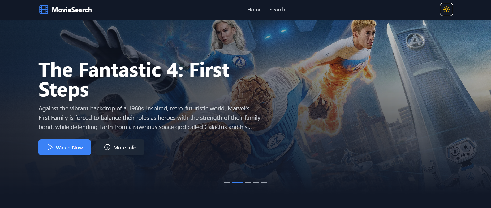
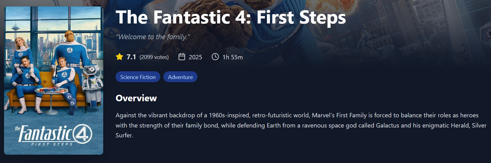

# 🎬 Movie Search

Ứng dụng tìm kiếm và khám phá phim hiện đại được xây dựng bằng React, TypeScript và Tailwind CSS, tích hợp TMDB API.

## ✨ Tính Năng

- 🔍 **Tìm kiếm phim** - Tìm kiếm hàng triệu bộ phim từ cơ sở dữ liệu TMDB
- 🎯 **Chi tiết phim** - Xem thông tin đầy đủ, trailer, cast và các phim tương tự
- 🎞️ **Hero Section** - Slideshow tự động với phim trending
- ⭐ **Đánh giá & Reviews** - Xem rating và số lượng votes
- 🎭 **Danh sách Cast** - Hiển thị diễn viên chính với ảnh và vai diễn
- 🎥 **Trailer YouTube** - Xem trailer trực tiếp trong trang
- 📱 **Responsive Design** - Giao diện mượt mà trên mọi thiết bị
- 🌓 **Dark Mode** - Chuyển đổi chế độ sáng/tối
- 🔗 **Route Navigation** - Điều hướng mượt mà với React Router
- 📄 **Phân trang** - Duyệt qua hàng nghìn kết quả tìm kiếm

## 🚀 Demo Trực Tuyến

👉 **[Xem Demo](https://movie-search-gules-kappa.vercel.app)**

## 🛠️ Công Nghệ Sử Dụng

- **React 19** - Thư viện UI hiện đại
- **TypeScript** - Type-safe development
- **Tailwind CSS 3** - Utility-first CSS framework
- **React Router DOM 7** - Client-side routing
- **Axios** - HTTP client cho API calls
- **Lucide React** - Bộ icon đẹp và nhẹ
- **TMDB API** - The Movie Database API
- **Vite** - Next generation build tool
- **Swiper** - Touch slider component

## 💻 Bắt Đầu

### Yêu Cầu

- Node.js 18+
- npm hoặc yarn
- API key từ TMDB (miễn phí)

### Cài Đặt

```bash
# Clone repository
git clone https://github.com/nbv9704/movie-search.git
cd movie-search

# Cài đặt dependencies
npm install

# Tạo file .env và thêm API keys
# VITE_TMDB_API_KEY=your_api_key_here
# VITE_TMDB_BASE_URL=https://api.themoviedb.org/3
# VITE_TMDB_IMAGE_BASE_URL=https://image.tmdb.org/t/p

# Chạy development server
npm run dev

# Build cho production
npm run build

# Preview production build
npm run preview
```

### Lấy TMDB API Key

1. Truy cập [TMDB](https://www.themoviedb.org/signup)
2. Đăng ký tài khoản miễn phí
3. Vào Settings → API → Request API Key
4. Copy API key và dán vào file `.env`

## 📸 Ảnh Chụp Màn Hình

### Light Mode


### Dark Mode


### Hero Section


### Movie Details


### Search Results


### Cast List


## 🎯 Kiến Thức Đạt Được

### 1. API Integration

- RESTful API integration với Axios
- Environment variables management
- Async/await và error handling
- Multiple concurrent API calls với Promise.all
- Response type definitions với TypeScript

### 2. TypeScript Best Practices

- Strong typing với interfaces
- Generic types cho reusable components
- Type-safe API responses
- Union types và optional properties
- Type inference và assertions

### 3. React Advanced Patterns

- Custom hooks (useMovies, useSearch)
- Component composition
- React Router v7 routing
- Dynamic route parameters
- URL search params management
- Conditional rendering patterns

### 4. State Management

- useState và useEffect hooks
- Derived state
- URL as state source
- Side effects handling
- Loading và error states

### 5. UI/UX Implementation

- Responsive grid layouts với Tailwind
- Dark mode với localStorage persistence
- Skeleton loading states
- Pagination component
- Search with debouncing
- Hero carousel với auto-play
- Image lazy loading
- Smooth transitions và hover effects

### 6. Performance Optimization

- Code splitting với React Router
- Lazy loading images
- Memoization opportunities
- Efficient re-renders
- Build optimization với Vite

## 🌍 TMDB API Usage

Ứng dụng sử dụng **The Movie Database (TMDB) API** với các endpoint:

- **Search Movies** - Tìm kiếm phim theo từ khóa
- **Popular Movies** - Danh sách phim phổ biến
- **Trending Movies** - Phim trending theo ngày/tuần
- **Movie Details** - Thông tin chi tiết phim
- **Movie Credits** - Cast và crew
- **Movie Videos** - Trailers và videos
- **Similar Movies** - Các phim tương tự
- **Free tier**: Unlimited requests (có rate limit)

## 🔮 Tính Năng Tương Lai

- [ ] User authentication với Firebase
- [ ] Watchlist và favorites
- [ ] Movie recommendations
- [ ] Advanced filters (genre, year, rating)
- [ ] TV Shows support
- [ ] Actor/Director pages
- [ ] Reviews và comments
- [ ] Share movie trên social media
- [ ] PWA support
- [ ] Multilingual support (Tiếng Việt)
- [ ] Watch providers integration
- [ ] Movie collections

## 🐛 Known Issues

- Placeholder images cần được thêm cho movies không có poster
- Rate limiting handling có thể được cải thiện
- SEO optimization cần meta tags động

## 👨‍💻 Tác Giả

**Ngô Bảo Việt**

- GitHub: [@nbv9704](https://github.com/nbv9704)
- Email: ngobaoviet97@gmail.com

## 📄 Giấy Phép

Dự án này là mã nguồn mở và có sẵn theo [Giấy phép MIT](LICENSE).

---

## 🌟 Đóng Góp

Mọi đóng góp đều được chào đón! Vui lòng tạo Pull Request hoặc mở Issue nếu bạn có ý tưởng cải thiện.
